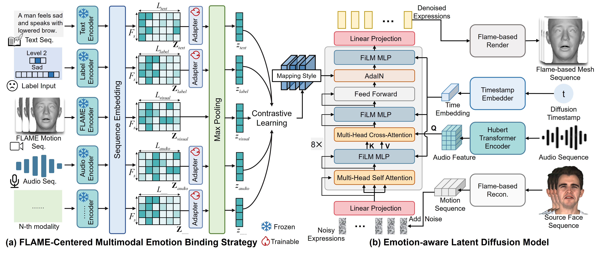

# Controllable Expressive 3D Facial Animation via Diffusion in a Unified Multimodal Space

Anonymous Authors

Submitted to ICME 2025

<!-- [Paper](#) | [Project Page](#) | [Code](#)  -->

## Abstract
Audio-driven emotional 3D facial animation encounters two significant challenges: (1) reliance on single-modal control signals (videos, text, or emotion labels) without leveraging their complementary strengths for comprehensive emotion manipulation, and (2) deterministic regression-based mapping that constrains the stochastic nature of emotional expressions and non-verbal behaviors, limiting the expressiveness of synthesized animations. To address these challenges, we present a diffusion-based framework for controllable expressive 3D facial animation. Our approach introduces two key innovations: (1) a FLAME-centered multimodal emotion binding strategy that aligns diverse modalities (text, audio, and emotion labels) through contrastive learning, enabling flexible emotion control from multiple signal sources, and (2) an attention-based latent diffusion model with content-aware attention and emotion-guided layers, which enriches motion diversity while maintaining temporal coherence and natural facial dynamics. Extensive experiments demonstrate that our method outperforms existing approaches across most metrics, achieving a 21.6\% improvement in emotion similarity while preserving physiologically plausible facial dynamics.

## Method Overview

## Supplementary Video Materials

### Introduction Video in Different Emotions

  

    <video width="80%" controls>
      <source src="videos/intro_combined_video_professional.mp4" type="video/mp4">
    </video>
    <em>Introduction Video in Different Emotions</em>
  

### Comparison of Different Methods (MEAD_emo dataset)

  

    <video width="80%" controls>
      <source src="videos/algorithm_comparison_m019_front_surprised_level_1_023_crop_detail.mp4.mp4" type="video/mp4">
    </video>
    <video width="80%" controls>
      <source src="videos/algorithm_comparison_m033_front_angry_level_1_014_crop_detail.mp4.mp4" type="video/mp4">
    </video>
    <video width="80%" controls>
      <source src="videos/algorithm_comparison_w018_front_sad_level_2_008_crop_detail.mp4.mp4" type="video/mp4">
    </video>
    <video width="80%" controls>
      <source src="videos/algorithm_comparison_w024_front_disgusted_level_2_056_crop_detail.mp4.mp4" type="video/mp4">
    </video>
    <video width="80%" controls>
      <source src="videos/algorithm_comparison_w024_front_happy_level_2_007_crop_detail.mp4.mp4" type="video/mp4">
    </video>
    <em>Comparison of Different Methods (MEAD_emo dataset)</em>
  

### Comparison of Different Methods (HDTF dataset)

  

    <video width="80%" controls>
      <source src="videos/algorithm_comparison_wra_kristinoem1_crop_256_000_detail.mp4.mp4" type="video/mp4">
    </video>
    <em>Comparison of Different Methods (HDTF dataset)</em>
  

### Weight Comparison Experiment

<video width="80%" controls>
  <source src="videos/weight_comparison_fear.mp4" type="video/mp4">
</video>
<video width="80%" controls>
  <source src="videos/weight_comparison_happy.mp4" type="video/mp4">
</video>

 
<em>Demonstration of Different Weights Effects</em>

### Comparison of Diffrent Modalities Driven Methods

  

    <video width="100%" controls>
      <source src="videos/modality_comparison_fear.mp4" type="video/mp4">
    </video>
    <video width="100%" controls>
      <source src="videos/modality_comparison_happy.mp4" type="video/mp4">
    </video>
    <video width="100%" controls>
      <source src="videos/modality_comparison_sad.mp4" type="video/mp4">
    </video>
    <em>Comparison of Diffrent Modalities Driven Methods</em>
  

### Ablation Study on Different Components

  

    <video width="100%" controls>
      <source src="videos/Components_comparison.mp4" type="video/mp4">
    </video>
    <em>Ablation Study on Different Components</em>
  

## Citation
If you find our work useful, please consider citing:
